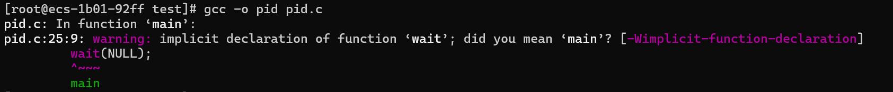

我是傻逼     makefile？是什么
实验一        
1.运行课本程序
对于所给程序，刚开始时我为了观察输入方便，在每个输出内加入了换行符\n,所输出的结果如下图所示。

代码块？
#include <sys/types.h>
#include <stdio.h>
#include <unistd.h>

int main()
{
    pid_t pid, pid1;

    /* fork a child process */
    pid = fork();

    if (pid < 0) { /* error occurred */
        fprintf(stderr, "Fork Failed");
        return 1;
    }
    else if (pid == 0) { /* child process */
        pid1 = getpid();
        printf("child: pid = %d\n", pid);   /* A */
        printf("child: pid1 = %d\n", pid1); /* B */
    }
    else { /* parent process */
        pid1 = getpid();
        printf("parent: pid = %d\n", pid);   /* C */
        printf("parent: pid1 = %d\n", pid1); /* D */
        wait(NULL);
    }

    return 0;
}
初步想法运行几十次获得统计性的一般规律。
在华为云和虚拟机分别运行
结果：
要不要加入头文件试试

去除wait的结果：

图片

